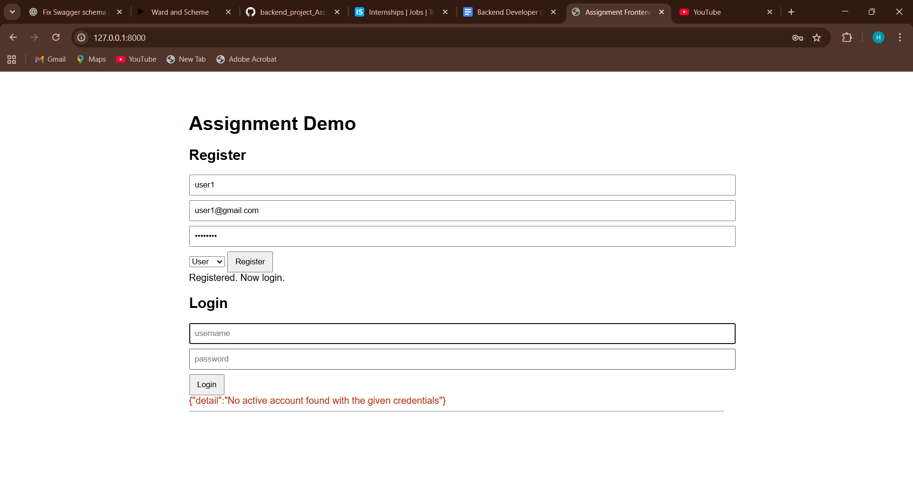
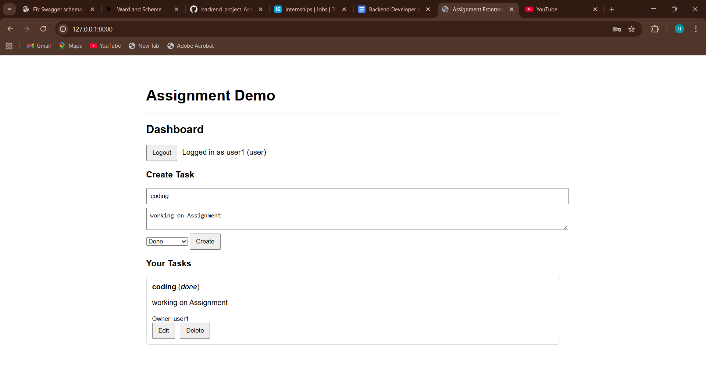
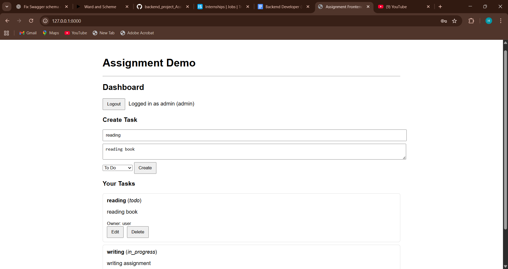
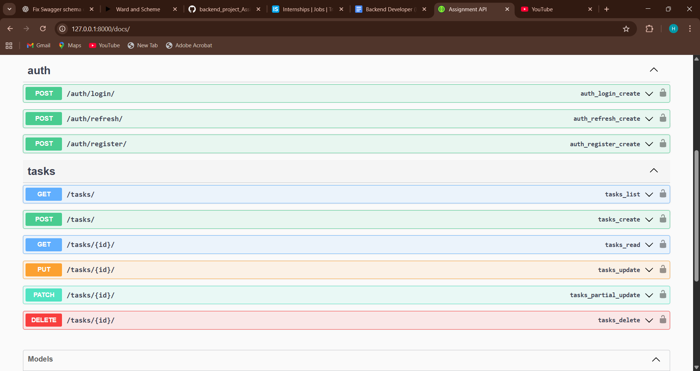

# backend_project_Assignment


---

# Task Manager Assignment

A simple task management system built with **Django REST Framework (DRF)** for the backend and a minimal **HTML + JavaScript frontend**.
Features include authentication (JWT), role-based access control, and CRUD operations for tasks.

---

## 🚀 Features

* User **Registration & Login** with JWT Authentication.
* **Role-based access** (Admin, User).
* Users can **create, update, delete, and view tasks**.
* Admins can view/manage all tasks.
* Minimal frontend (`index.html`) that interacts with the backend using fetch API.

---

## 🛠 Tech Stack

* **Backend**: Django, Django REST Framework, JWT (SimpleJWT)
* **Frontend**: HTML, CSS, JavaScript
* **Database**: SQLite (default, can be swapped with PostgreSQL/MySQL)
* **Tools**: Postman for API testing

---


Got it ✅ You don’t need a separate file then — we’ll put the requirements section directly inside your **README.md**.

Here’s a polished template for your assignment README (with requirements included):

---


* 📄 API Documentation via Postman/Swagger (if added)

---

## 🛠 Requirements

Install the following dependencies:

```txt
Django==4.2
djangorestframework==3.15.0
djangorestframework-simplejwt==5.2.2
drf-yasg==1.21.6
```


## ⚙️ Installation

### 1️⃣ Clone the repository

```bash
git clone https://github.com/yourusername/task-manager.git
cd task-manager
```

### 2️⃣ Create virtual environment

```bash
python -m venv venv
venv\Scripts\activate    # on Windows
source venv/bin/activate # on Mac/Linux
```

### 3️⃣ Install dependencies

```bash
pip install -r requirements.txt
```

### 4️⃣ Apply migrations

```bash
python manage.py migrate
```

### 5️⃣ Run the server

```bash
python manage.py runserver
```

---

## 🌐 API Endpoints

### Auth

* `POST /api/v1/auth/register/` → Register a new user
* `POST /api/v1/auth/login/` → Login & get JWT tokens

### Tasks

* `GET /api/v1/tasks/` → List tasks
* `POST /api/v1/tasks/` → Create task
* `PUT /api/v1/tasks/<id>/` → Update task
* `DELETE /api/v1/tasks/<id>/` → Delete task

---

## 📄 Example (Register User)

```bash
curl -X POST http://127.0.0.1:8000/api/v1/auth/register/ \
-H "Content-Type: application/json" \
-d '{"username":"harshada", "email":"test@example.com", "password":"1234", "role":"user"}'
```

---

## 🖥️ Frontend

* The frontend is inside:

  ```
  templates/frontend/index.html
  ```
* It supports:

  * Register / Login
  * JWT-based session
  * Task CRUD

Open `http://127.0.0.1:8000/` after running the server.

---

## 📈 Scalability Notes

* Can be containerized with **Docker** for deployment.
* Replace SQLite with **PostgreSQL/MySQL** for production.
* Use **Redis** for caching and session management.
* Add **Celery** for background task processing.
* Add **Swagger** (`drf-yasg`) for API documentation.

---

## ✅ Submission Checklist

* [x] Backend complete (Django + DRF + JWT)
* [x] Frontend complete (index.html)
* [x] Role-based tasks
* [x] README.md with setup instructions

---
## 📸 Screenshots  

### 🔐 Authentication (Register & Login)  
  

### 📝 Dashboard – User View  
  

### 🛠 Dashboard – Admin View  
  

### 📄 API Documentation (Swagger)  
  


